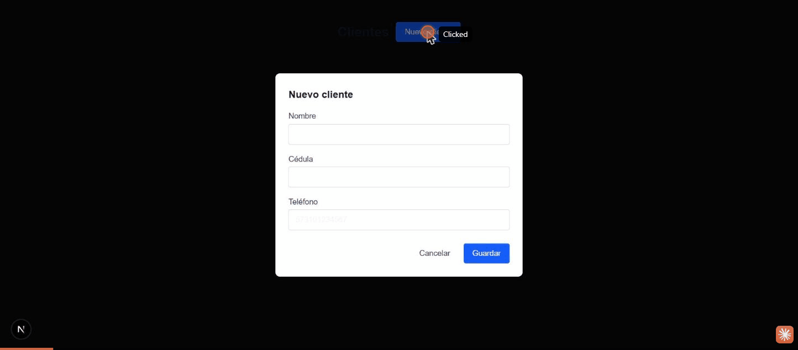

# WhatsApp Order Notification

Aplicación de aprendizaje que permite registrar clientes y notificarles automáticamente por WhatsApp cuando su pedido está listo. Proyecto de portafolio enfocado en integrar **ASP.NET Core**, **PostgreSQL**, **Next.js** y **n8n + Evolution API**.

Ver [`Plan-Requerimientos.md`](./Plan-Requerimientos.md) para el detalle de requerimientos y [`plan-cc.md`](./plan-cc.md) para el plan de ejecución y stack técnico.

## Demo



Flujo mostrado: pantalla vacía → crear cliente ("Juan Perez") → queda en estado `Pendiente` → clic en "Marcar como listo" → cambia a `Listo` (notificación enviada exitosamente vía un webhook simulado de n8n/Evolution API).

## Estructura del repositorio

```
backend/     API REST en ASP.NET Core 8 (Controllers, Services, Repositories, Data)
frontend/    Next.js + TypeScript + Tailwind CSS + React Hook Form
docker-compose.yml   PostgreSQL para desarrollo local
```

## Requisitos previos

- .NET 8 SDK
- Node.js 18+
- Docker (para PostgreSQL)
- Una instancia de [n8n](https://n8n.io/) y de [Evolution API](https://doc.evolution-api.com/) (para el envío real de WhatsApp)

## Puesta en marcha

### 1. Base de datos

```bash
docker compose up -d postgres
```

Levanta PostgreSQL en `localhost:5432` (usuario/clave `postgres`, base `whatsapp_order_notification`).

### 2. Backend

```bash
cd backend/WhatsAppOrderNotification.Api
dotnet ef database update   # aplica la migración inicial (ya incluida en el repo)
dotnet run --urls http://localhost:5199
```

- Swagger disponible en `http://localhost:5199/swagger`.
- Configuración relevante en `appsettings.json`:
  - `ConnectionStrings:DefaultConnection` — cadena de conexión a PostgreSQL.
  - `N8n:WebhookUrl` — URL del webhook de n8n que dispara la notificación de WhatsApp.

### 3. Frontend

```bash
cd frontend
npm install
npm run dev
```

- App disponible en `http://localhost:3000`.
- Variable de entorno en `.env.local`: `NEXT_PUBLIC_API_URL` (por defecto `http://localhost:5199`).

### 4. n8n (automatización de WhatsApp)

El workflow **"Customer Ready Notification"** ya está creado en n8n con dos nodos:

1. **Webhook** (`POST /webhook/customer-ready`) — recibe `{ "name": "...", "phone": "..." }` desde el backend. Ya probado y funcionando.
2. **HTTP Request** → Evolution API — **pendiente de configurar** (ver sección siguiente).

## Pendiente: credenciales de Evolution API

El nodo HTTP Request del workflow de n8n todavía tiene valores placeholder:

- URL: `https://TU-SERVIDOR-EVOLUTION-API/message/sendText/TU-INSTANCIA`
- Header `apikey`: `TU-EVOLUTION-API-KEY`

Para dejar el envío real de WhatsApp funcionando falta:

1. Reemplazar la URL por la de tu servidor de Evolution API y el nombre de tu instancia.
2. Reemplazar el valor del header `apikey` por tu API key real.
3. Verificar el formato exacto del body esperado por tu versión de Evolution API (puede variar; el body actual usa `{ "number": "...", "textMessage": { "text": "..." } }`).
4. **Activar** el workflow en n8n (toggle "Publish"/Active) para que la URL de producción del webhook quede escuchando.

Hasta que esto se complete, el backend recibe un error (`502 Bad Gateway`) al intentar notificar y el cliente permanece en estado `Pendiente` — este comportamiento es intencional (no se marca como notificado si el envío falla).

## Flujo funcional

1. El empleado registra un cliente (queda en estado `Pendiente`).
2. Cuando el pedido está listo, hace clic en "Marcar como listo".
3. El backend cambia el estado a `Listo` y llama al webhook de n8n con `{ name, phone }`.
4. n8n reenvía el mensaje a Evolution API, que lo entrega por WhatsApp.

## Pruebas realizadas

- CRUD completo de clientes (crear, listar, editar, eliminar) probado end-to-end vía UI.
- Validaciones: nombre/teléfono/cédula obligatorios, cédula duplicada (tanto en creación como edición).
- Flujo de notificación probado con un servidor mock simulando a n8n/Evolution API (éxito y fallo), confirmando que el estado solo cambia a `Listo` cuando la notificación se envía correctamente.
- Persistencia verificada recargando la aplicación tras cada operación.

## Aprendizajes del proyecto

- Integración de ASP.NET Core con PostgreSQL vía Entity Framework Core (migraciones, índices únicos).
- Arquitectura por capas simple (Controllers → Services → Repositories → Data) sin Clean Architecture.
- Consumo de una API REST desde Next.js (App Router) con manejo de errores tipado.
- Diseño de un webhook saliente desde el backend hacia n8n, y construcción de un workflow n8n con nodos Webhook + HTTP Request.
- Reemplazo de diálogos nativos del navegador (`alert`/`confirm`) por UI propia para evitar bloqueos y mejorar la experiencia de usuario.
